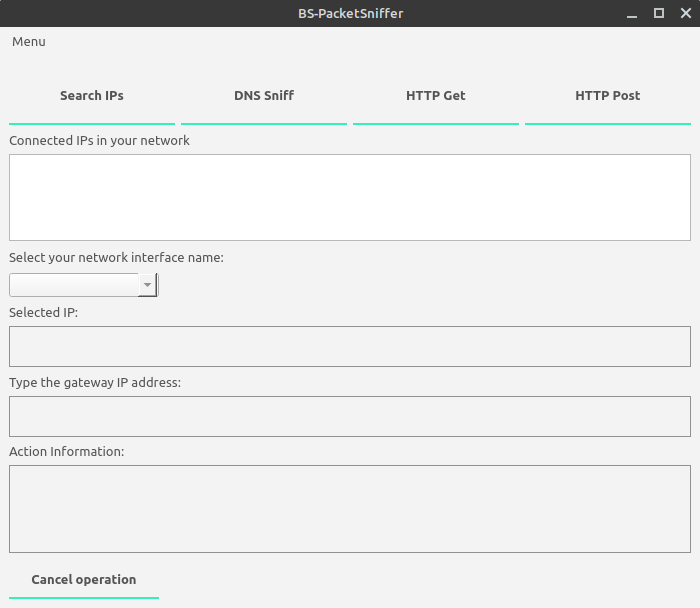

# PacketSniffer

<p>
  
  
  
  
  
  

  
  
  
</p>
<br/>

PyQt5 software to arp spoof an IP in local network and sniff their dns packets to output the websites they visit.


## Installation
Python3 \
PyQt5 \
python-nmap module \
nmap \
scapy

## Usage
From your terminal:
```bash
cd /../../project_files
```
type:
```bash
python3 main.py
```


## Contributing
Pull requests are welcome. For major changes, please open an issue first to discuss what you would like to change.

Please make sure to update tests as appropriate.

## License
[MIT](https://choosealicense.com/licenses/mit/)
